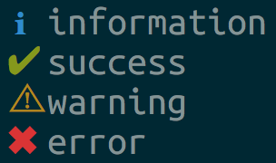
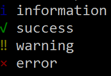

[![Tests][tests-badge]][tests-link]
[![Go Report Card][report-badge]][report-link]
[![Go Reference][reference-badge]][reference-link]
[![License][license-badge]][license-link]
[![Coverage][coverage-badge]][coverage-link]

# log symbols

> Colored symbols for various log levels
Includes fallbacks for Windows CMD which only supports a [limited character set](https://en.wikipedia.org/wiki/Code_page_437).


### Linux/Mac


### Windows




## Install

```
$ go get github.com/guumaster/logsymbols
```

## Usage

### Basic example
```go

package main

import (
  "fmt"
  "github.com/guumaster/logsymbols"
)

func main() {
    fmt.Println(logsymbols.Success, 'Finished successfully!')
    fmt.Println(logsymbols.Error, 'Something broke')

    // On good OSes:  ✔ Finished successfully!
    //                ✖ Something broke

    // On Windows:    √ Finished successfully!
    //                × Something broke
}

```

### Forcing colors

`logsymbols` will autodetect if its not in TTY mode and remove all colors. You can force color output with this example:

```go

  	logsymbols.ForceColors()
    fmt.Println(logsymbols.Success, 'Finished successfully!')

    // Terminal Output:  ✔ Finished successfully!
    // Redirected Output:       ^[[1;32m✔^[[0m Finished successfully!
}

```
### Fallback Symbols

`logsymbols` will autodetect which OS is running and will change to the proper icons on Windows. 

You also can get the fallback symbols with this example:

```go

    fallback := logsymbols.FallbackSymbols()
    fmt.Println(fallback.Success, 'Finished successfully!')

    // Output:  √ Finished successfully!
}

```

### More examples

See [example folder](example/main.go)


## Ported from npm version

- [sindresorhus/log-symbols](https://github.com/sindresorhus/log-symbols) - Colored symbols for various log levels


## Related

- [prabirshrestha/go-log-symbols](https://github.com/prabirshrestha/go-log-symbols)


## Author(s)

* [guumaster](https://github.com/guumaster)

If you like this tool and think is worth it, you can invite me a coffee: 

[![paypal.me/guumaster][paypal-badge]][paypal-link]
[![ko-fi.com/guumaster][kofi-badge]][kofi-link]


## LICENSE

 [MIT license](LICENSE)


<!-- JUST BADGES & LINKS -->
[tests-badge]: https://img.shields.io/github/workflow/status/guumaster/logsymbols/Test
[tests-link]: https://github.com/guumaster/logsymbols/actions?query=workflow%3ATest

[report-badge]: https://goreportcard.com/badge/github.com/guumaster/logsymbols
[report-link]: https://goreportcard.com/report/github.com/guumaster/logsymbols

[reference-badge]: https://godoc.org/github.com/guumaster/logsymbols?status.svg
[reference-link]: https://pkg.go.dev/github.com/guumaster/logsymbols?tab=overview


[license-badge]: https://img.shields.io/github/license/guumaster/logsymbols
[license-link]: https://github.com/guumaster/logsymbols/blob/master/LICENSE

[coverage-badge]: https://sonarcloud.io/api/project_badges/measure?project=guumaster_logsymbols&metric=coverage
[coverage-link]: https://sonarcloud.io/dashboard?id=guumaster_logsymbols

[paypal-link]: https://www.paypal.me/guumaster
[paypal-badge]: https://img.shields.io/static/v1?label=donate&message=PayPal&color=00457C&logo=paypal

[kofi-link]: https://ko-fi.com/guumaster
[kofi-badge]: https://img.shields.io/static/v1?label=donate&message=Ko-fi&color=F16061&logo=ko-fi
